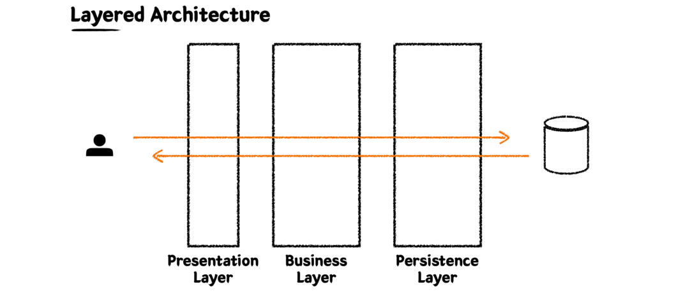
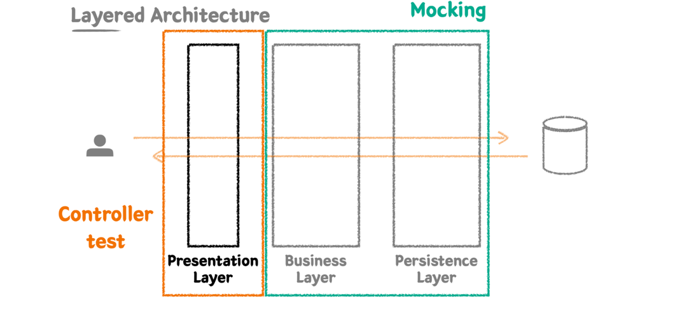
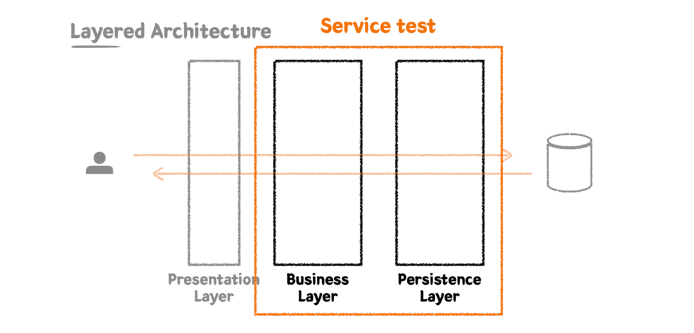
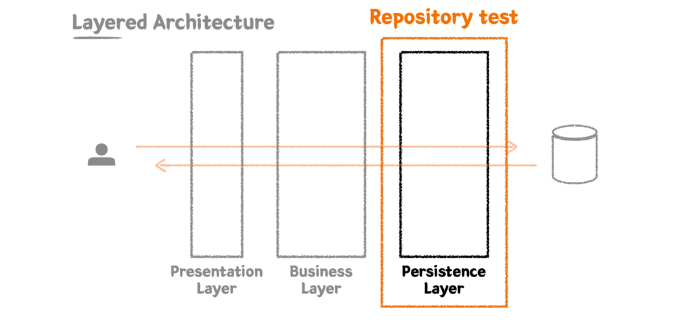

# Layered Architecture 레이어별 테스트 전략 정리



레이어드 구조는 각각의 레이어가 ‘관심사의 분리’를 담당한다. 테스트 또한 이 관심사에 맞춰 "무엇을 테스트해야 하고, 무엇을 테스트하지 않아야 하는지" 를 명확히 해야 한다.

## Presentation Layer: Controller



✅ 역할
- API 요청의 시작점
- Request Body의 유효성 검증
- Response 구조화

✅ 테스트 핵심
- 올바른 Request → 적절한 응답이 나오는지
- 잘못된 Request → 올바른 에러가 응답되는지
- HTTP 상태 코드 / 응답 JSON 구조 검증

✅ 테스트 코드 예시
```java
@WebMvcTest(MemberController.class)
class MemberControllerTest {

    @Autowired
    private MockMvc mockMvc;

    @Test
    void 유효하지_않은_요청_이면_400_에러() throws Exception {
        String invalidRequest = "{\"name\":\"\"}";

        mockMvc.perform(post("/members")
                .contentType(MediaType.APPLICATION_JSON)
                .content(invalidRequest))
                .andExpect(status().isBadRequest());
    }

    @Test
    void 정상_요청이면_201_응답() throws Exception {
        String validRequest = "{\"name\":\"John\"}";

        mockMvc.perform(post("/members")
                .contentType(MediaType.APPLICATION_JSON)
                .content(validRequest))
                .andExpect(status().isCreated())
                .andExpect(jsonPath("$.id").exists());
    }
}
```

## Business Layer: Service



✅ 역할
- 핵심 도메인 로직 처리
- 조건 판단, 가공 처리, 예외 처리
- DB 접근은 Repository에 위임 (직접 접근 X)

✅ 테스트 핵심
- 비즈니스 로직이 제대로 작동하는가?
- 예외 상황에 맞게 동작하는가?
- 외부 의존성(Repository)은 Mock 처리해서 테스트의 초점을 로직에 맞춘다.

✅ 테스트 코드 예시
```java
@ExtendWith(MockitoExtension.class)
class MemberServiceTest {

    @InjectMocks
    private MemberService memberService;

    @Mock
    private MemberRepository memberRepository;

    @Test
    void 회원이_이미_존재하면_예외_발생() {
        given(memberRepository.existsByName("John")).willReturn(true);

        assertThrows(DuplicateMemberException.class, () -> {
            memberService.createMember("John");
        });
    }

    @Test
    void 회원이_없으면_정상_등록() {
        given(memberRepository.existsByName("John")).willReturn(false);
        given(memberRepository.save(any())).willReturn(new Member("John"));

        Member member = memberService.createMember("John");

        assertEquals("John", member.getName());
    }
}
```

## Persistence Layer: Repository



✅ 역할
- DB에 데이터를 저장하거나 조회
- JPA/Hibernate/MyBatis 등 실제 쿼리 로직
- 트랜잭션 단위, 성능, 쿼리 정확도에 민감

✅ 테스트 핵심
- 쿼리가 제대로 동작하는가?
- 의도한 데이터가 DB에 저장/조회 되는가?
- 실제 DB를 붙여서 테스트 (H2, TestContainers 권장)

✅ 테스트 코드 예시
```java
@DataJpaTest
class MemberRepositoryTest {

    @Autowired
    private MemberRepository memberRepository;

    @Test
    void 이름으로_회원_조회() {
        Member saved = memberRepository.save(new Member("Jane"));

        Optional<Member> result = memberRepository.findByName("Jane");

        assertTrue(result.isPresent());
        assertEquals("Jane", result.get().getName());
    }
}
```

## 강의에 나오면서 스스로 생각해보면 좋은 것

### @Transactionl vs deleteAll vs deleteAllInBatch
 
"테스트 격리를 어떻게 유지할 것인가?"를 중심으로 정리

#### @Transactional
- 테스트마다 트랜잭션을 열고, 끝나면 롤백한다.
- 즉, 데이터는 테스트 이후 자동 삭제된다.
- 장점: 테스트 간 데이터 격리가 완벽하다.
- 단점
  - 테스트 중간에 데이터가 실제로 커밋되지 않기 때문에, DB에 커밋된 결과를 직접 보는 테스트에는 적절하지 않음.
  - ex) JPA의 Flush 타이밍이나 실제 쿼리 확인이 목적일 경우, @Transactional이 오히려 방해가 됨.

#### deleteAll()
- Spring Data JPA에서 제공하는 모든 엔티티를 루프 돌며 삭제하는 메서드
- 내부적으로는 각 엔티티에 대해 SELECT + DELETE 발생
- 장점: 직관적이고 JPA flush 타이밍 등을 확인할 수 있음
- 단점: 성능이 느리다 (대량 데이터 테스트 시 특히)

#### deleteAllInBatch()
- JPA 내부 동작을 건너뛰고, 바로 쿼리 한 방으로 DELETE 실행(예: DELETE FROM member)
- 장점: deleteAll()보다 훨씬 빠름, 특히 대량 데이터에서
- 단점: 영속성 컨텍스트를 고려하지 않고 삭제하기 때문에, flush 되지 않은 객체가 있으면 오류 발생 가능

### Test Fixure: "테스트 데이터 설계, 진짜 고민하고 있나?"
✅ Fixture가 필요한 이유
- 테스트는 코드의 동작을 검증하는 것뿐 아니라, **문맥(context)**을 재현하는 작업이다.
- Fixture 설계의 본질은 단순한 데이터 삽입이 아니라 '의도된 상황을 만드는 것'

✅ Fixture 설계의 3가지 포인트
1. 테스트 목적에 맞게 데이터를 최소화하라
- 불필요한 데이터는 오히려 테스트의 의도를 흐림
- 예: 회원 1명 생성 → 저장됨을 확인 테스트에 3명 생성? → No.

2. 중복을 줄이되 가독성을 포기하지 마라
- FixtureFactory.createMember("Alice") 같은 메서드로 공통화
- 하지만 테스트 내에서 어떤 상황인지 명확하게 표현될 것

```java
// 비추
Member member = createDefaultMember();

// 추천
Member member = createMember("Alice", 25, "premium");
```

3. 의도를 표현하는 네이밍
- givenPremiumMemberExists()
- givenProductStockIsZero()
→ 이 자체가 "읽는 문서"가 된다

✅ 예시: Fixture 유틸 함수 만들기
```java
public class MemberFixture {

    public static Member createPremiumMember(String name) {
        return new Member(name, 30, Grade.PREMIUM);
    }

    public static Member createNormalMember(String name) {
        return new Member(name, 20, Grade.NORMAL);
    }
}
```
🧩 Test Fixture에 대한 내 생각
- 테스트는 ‘입력 → 기대 결과’만으로 설명될 수 없다. 그 입력이 왜 존재하고, 어떤 상황을 가정한 건지를 명확히 드러내야 신뢰할 수 있다.
- 결국 좋은 테스트는 “이 테스트가 어떤 문맥에서 작동하는지를 설명할 수 있는 데이터 설계 능력”에서 갈린다.

## 🧭 나만의 정리
- Presentation Layer는 형식 검증 + 응답 검증
- Business Layer는 로직 검증
- Persistence Layer는 쿼리 자체 검증

→ 각 레이어가 자신의 책임만 테스트해야 테스트의 의도가 선명해지고, 중복도 줄어들며 유지보수가 쉬워진다.

[출처]
인프런 워밍업 클럽 : [링크](https://www.inflearn.com/course/offline/warmup-club-3-be-code)

강의 : [링크](https://www.inflearn.com/course/readable-code-%EC%9D%BD%EA%B8%B0%EC%A2%8B%EC%9D%80%EC%BD%94%EB%93%9C-%EC%9E%91%EC%84%B1%EC%82%AC%EA%B3%A0%EB%B2%95/dashboard)